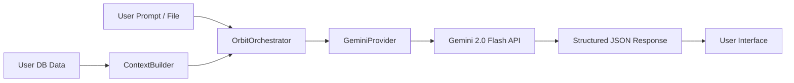
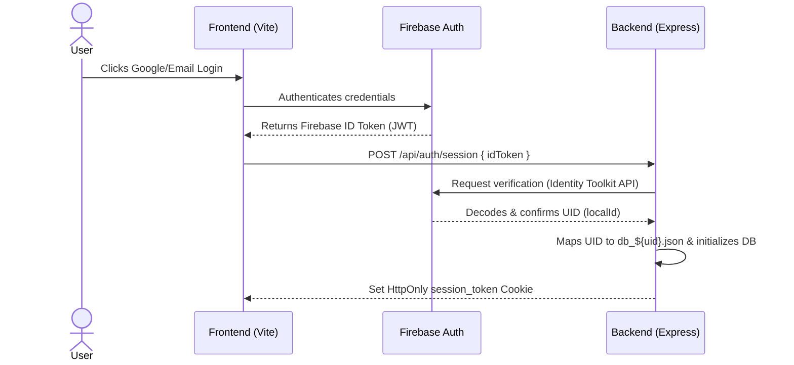
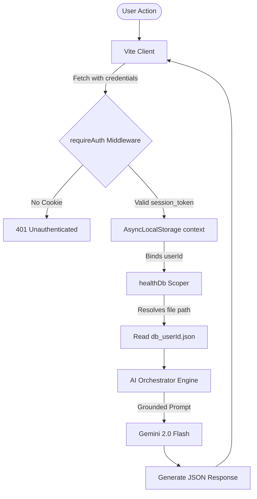

# Orbit — Orbit

*"One AI. One Timeline. One Companion. Every Part of Your Life."*

Orbit is an AI-powered personal life companion and personal operating system. Rather than treating different areas of a user's life as isolated tabs, Orbit brings them together into one intelligent, context-aware system. It parses calendar timelines, local weather, financials, health trends, and personal documents to generate unified life insights and assist in critical daily decisions.

---

## Developer Notice
> [!NOTE]
> This repository is a fully functional prototype combining a React web client with an Express node backend. It utilizes **Firebase Authentication** for identity validation, **Google Fit / Calendar APIs** for real-time lifecycle synchronization, and **Gemini 2.0 Flash** for orchestration and reasoning.

---

## Table of Contents
1. [What is Orbit?](#what-is-orbit)
2. [Problem Statement](#problem-statement)
3. [Vision & Privacy Guardrails](#vision--privacy-guardrails)
4. [Core Features & Module Status](#core-features--module-status)
5. [AI Architecture](#ai-architecture)
6. [Authentication Architecture](#authentication-architecture)
7. [Database Architecture](#database-architecture)
8. [Data Flow Diagrams](#data-flow-diagrams)
9. [System Architecture](#system-architecture)
10. [Local Development Setup](#local-development-setup)

---

## What is Orbit?

Traditional applications isolate your life details:
* **Health app** → stores steps and sleep metrics.
* **Bank app** → stores financial balances and transactions.
* **Calendar** → tracks scheduled events.
* **Cloud Storage** → archives documents.
* **Chatbot** → provides generic conversations with no personal context.

Orbit is the unified ecosystem layer. By analyzing the relationships between different data points, Orbit understands personal lifecycles:

$$\text{Poor Sleep} + \text{Heavy Workload} + \text{Upcoming Event} + \text{Lagging Goal} \xrightarrow{\text{Orbit Copilot}} \text{Proactive Insight}$$

Orbit acts as a context-aware personal intelligence layer that transforms fragmented digital metrics into actionable life strategy recommendations.

---

## Problem Statement

Modern personal computing is fragmented. A user's typical daily operations are divided among distinct SaaS solutions, government portals, health logs, and financial ledgers. Because these applications are siloed:
1. They cannot share contextual information.
2. The user is forced to perform manual correlation (e.g. tracking how financial stress affects sleep quality or schedule discipline).
3. General-purpose AI assistants lack persistent, structured access to this data, leading to generic and ungrounded interactions.

Orbit addresses this gap by creating a secure, client-validated aggregator designed to provide cross-domain intelligence.

---

## Vision & Privacy Guardrails

Orbit's long-term goal is to serve as a secure digital twin. To ensure safety, Orbit operates under strict architectural principles:
* **Strict Permission Scope**: Orbit only accesses data categories explicitly consented to by the user (such as Google Calendar read-only access or Google Fit logs).
* **Data Isolation**: Database reads, writes, vaults, and decision histories are dynamically scoped by the active user's verified session. Data is segregated so no cross-user contamination is possible.
* **User Control**: Users can wipe their personal document vault, reset their isolated databases, or sign out instantly.

---

## Core Features & Module Status

### 1. Central Dashboard / AI Daily Brief
* **Status**: **Implemented**
* **Capabilities**: Renders a narrative print-style overview of the user's upcoming day. Integrates real-time **Google Calendar** timelines, live weather forecasting via the **Open-Meteo API**, and computes a dynamic "Life Score" reflecting financial health, sleep trends, and goal completion.

### 2. Health Intelligence
* **Status**: **Implemented**
* **Capabilities**: Charts weekly steps, sleep latency/phases, average heart rate (BPM), exercise sessions, water logs, and body weight. Connects directly to the **Google Fitness API** for real-time telemetry, with a fully simulated fallback provider for offline development.

### 3. Document Brain
* **Status**: **Implemented**
* **Capabilities**: Renders a "Digital Life Vault" allowing users to upload identity cards, medical reports, rentals, and invoices. Automatically extracts categories, summaries, key values, and renewal dates using multimodal **Gemini 2.0 Flash** prompts. Includes a document search and a grounded chat panel to query specific details (e.g. asking a PDF lease about late payment penalties).

### 4. AI Decision Engine
* **Status**: **Implemented**
* **Capabilities**: Allows users to frame difficult dilemmas (e.g., career moves, large financial investments). Orbit analyzes the request in context of the user's current isolated financial balances, goals, and workloads to output a structured recommendation detailing pros, cons, and risk assessments.
* *Note: AI Decision Engine outputs represent mathematical and LLM-assisted options; they do not replace certified financial or medical consultations.*

### 5. Finance Brain
* **Status**: **Implemented**
* **Capabilities**: Tracks monthly income, expenses, custom budgets, and long-term savings. Categorizes transactions (e.g., Food, Housing, Utilities) and displays dynamic budget overrun warnings.

### 6. Goal & Habit Engine
* **Status**: **Implemented**
* **Capabilities**: Logs active habits and long-term milestones. Displays active streaks and calculates overall completion rates.

### 7. Scam Detector
* **Status**: **Implemented**
* **Capabilities**: Evaluates suspicious text messages, emails, or communications. Utilizes Gemini pattern matching to flag phishing vectors, calculate risk scores, and highlight specific red flags (e.g., sense of urgency, mismatched domains).
* *Note: Scam evaluations are advisory; they do not represent absolute security guarantees.*

---

## AI Architecture

Orbit implements a structured prompt-orchestrator pattern rather than an open-ended chatbot. The context compilation flows as follows:



### Document Search & Q&A Grounding
1. The document is uploaded to the backend as a base64 buffer.
2. The user queries the vault via keyword search. The system performs an initial keyword matching and sends a summary catalog to the LLM to return relevance-ordered IDs.
3. For specific document Q&A, the query combines the text metadata context alongside the base64 document bytes, passing it as a multimodal payload to Gemini for grounded verification.

---

## Authentication Architecture

Orbit uses **Firebase Authentication** as the identity source of truth. The application follows a fail-secure token validation model:



* **Security Rule**: The frontend is never trusted to specify a user's identity. The backend verifies the short-lived Firebase ID token, resolves the user ID directly from Google's signing authority, and generates a corresponding local session.

---

## Database Architecture

### Current Implementation: Local User-Isolated JSON Store
To ensure zero configuration setup and rapid local deployment, Orbit uses a user-scoped JSON database pattern stored under `backend/data/`:
* `users.json`: Stores user records, registration sources, and creation dates.
* `sessions.json`: Maps active local session tokens to users.
* `db_${userId}.json`: Scopes all health profiles, goals, habits, and budgets.
* `documents_${userId}.json`: Contains document metadata, category classes, and OCR summary records.
* `decisions_${userId}.json`: Holds historical dilemmas, options, and generated AI recommendations.

### Planned Transition: Neon PostgreSQL
* **Production Path**: Transition local JSON adapters to Neon PostgreSQL.
* **Pgvector Integration**: Migrate the Document Brain's relevance scoring to use vector embeddings stored in a `pgvector` column for semantic search and scalable RAG indexing.

---

## Data Flow Diagrams

The following diagram traces the end-to-end data flow for a secured API call:



---

## System Architecture

```mermaid
flowchart TD
    User([User Client]) --> WebUI[React Web App]
    subgraph Frontend (Port 5173)
        WebUI --> AuthContext[AuthContext.jsx]
        WebUI --> Dashboard[Dashboard.jsx]
        AuthContext --> FBClient[Firebase Web SDK]
    end

    subgraph Backend (Port 5001)
        API[Express Router] --> AuthGuard[requireAuth Guard]
        AuthGuard --> ALS[AsyncLocalStorage Context]
        ALS --> DB[healthDb.js File Database]
        ALS --> AIOrch[OrbitOrchestrator]
    end

    FBClient -.->|Google OAuth Flow| GoogleAuth[Google Auth Services]
    AuthContext -->|POST /api/auth/session| API
    AIOrch -->|API Key Auth| Gemini[Gemini 2.0 Flash API]
    API -->|Fetch Verification| IdentityAPI[Google Identity Toolkit REST API]
```

---

## Local Development Setup

### 1. Prerequisites
* **Node.js** (v18+)
* **Gemini API Key** (from [Google AI Studio](https://aistudio.google.com/))
* **Google OAuth Credentials** (for Calendar & Fit APIs)

### 3. Installation
Clone the repository and install dependencies:
```bash
# Install backend dependencies
cd backend
npm install

# Install frontend dependencies
cd ../frontend
npm install
```

### 4. Environment Configuration
Create a `.env` file in the `backend/` directory:
```env
PORT=5001
GEMINI_API_KEY=your_gemini_api_key_here
GOOGLE_CLIENT_ID=your_google_oauth_client_id.apps.googleusercontent.com
GOOGLE_CLIENT_SECRET=your_google_oauth_client_secret
FIREBASE_API_KEY=your_firebase_web_api_key_here
```

Ensure your Firebase redirect domain configurations on the Google Cloud Console include `localhost`.

### 5. Running the Servers
Start the Express API server:
```bash
cd backend
npm run dev
```

Start the Vite React client:
```bash
cd frontend
npm run dev
```

Open `http://localhost:5173` in your browser.
